# Items gallery

Auto-generated by `scripts/build_catalog.py`. Do not hand-edit — regenerate after capture.

Interactive browser: [`presentation/catalog.html`](../presentation/catalog.html)

| id | name | type | softkitty_id | preview |
|----|----|----|----|----|
| `ability_blue_nova` | BlueNova | skill | 104 |  |
| `ability_bunny` | Bunny | skill | 93 | 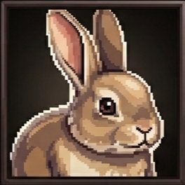 |
| `ability_cat` | Cat | skill | 94 | 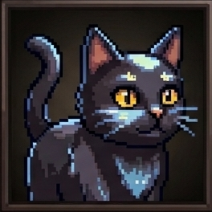 |
| `ability_dance` | Dance | skill | 95 | 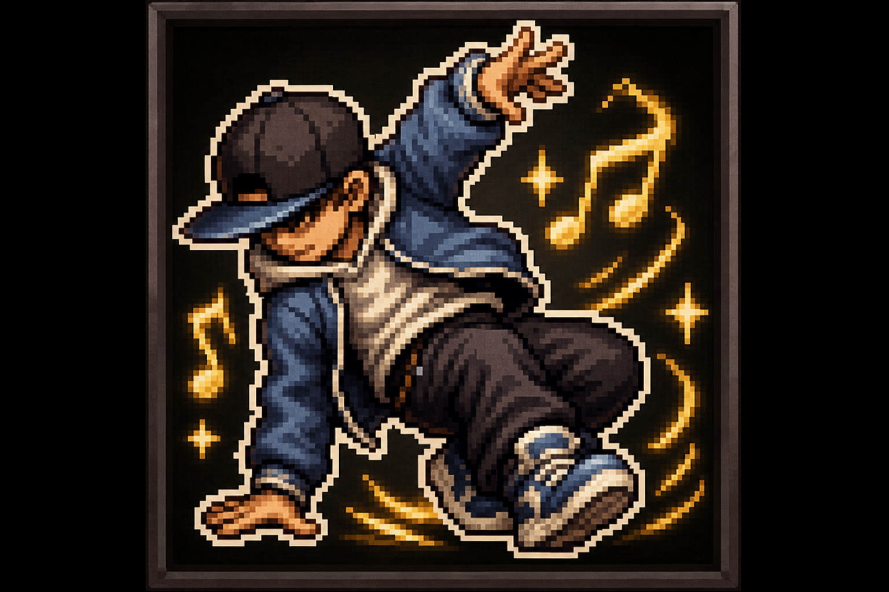 |
| `ability_ice_burst` | IceBurst | skill | 101 | 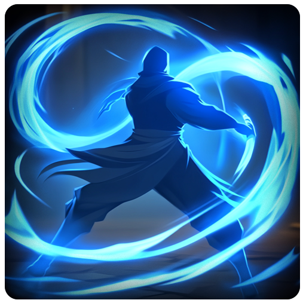 |
| `ability_ice_crystals` | Ice Crystals | skill | 100 |  |
| `ability_magic_bolt` | Magic Bolt | skill | 96 |  |
| `ability_magic_nova` | PurpleNova | skill | 97 | 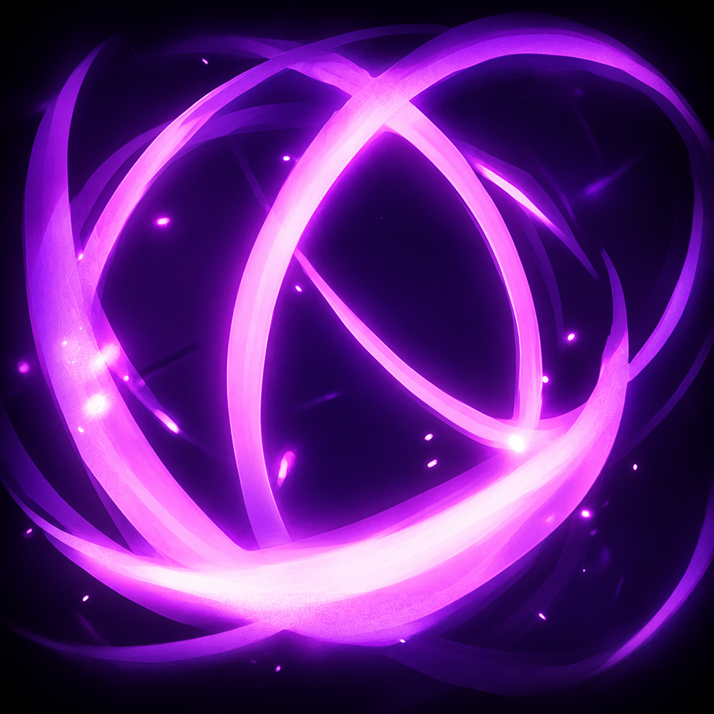 |
| `ability_magic_slash` | Magic Slash | skill | 98 | 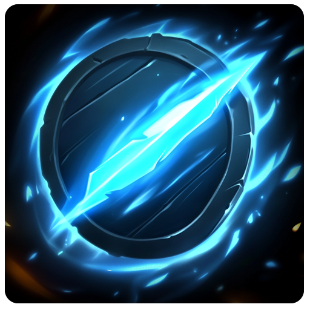 |
| `ability_meteor_shower` | Meteor Shower | skill | 105 |  |
| `ability_owl` | Owl | skill | 92 | 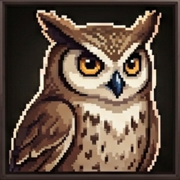 |
| `ability_red_energy_explosion` | Red Energy Explosion | skill | 102 | 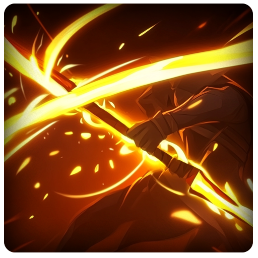 |
| `ability_red_nova` | RedNova | skill | 103 |  |
| `ancient_ring` | Ancient Ring | equipment | 38 | 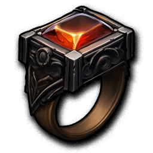 |
| `ancient_rune` | Ancient Rune | material | 60 | 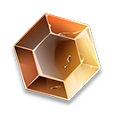 |
| `bear_skin` | Bear's Skin | material | 13 | 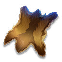 |
| `bear_tooth` | Bear's Tooth | material | 15 | 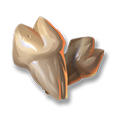 |
| `blue_gem_necklace` | Blue Gem Necklace | equipment | 40 | 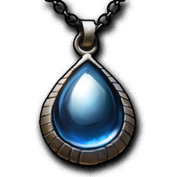 |
| `buckler` | Buckler | equipment | 56 | 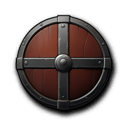 |
| `coin` | Coin | currency |  | *(no image)* |
| `copper_ore` | Copper Ore | material | 7 | 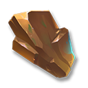 |
| `copper_ring` | Copper Ring | equipment | 37 | 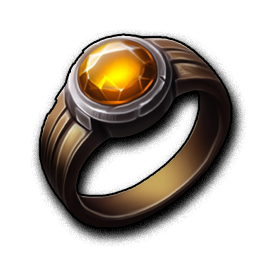 |
| `corn` | Corn | material | 20 | 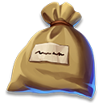 |
| `dark_hoods` | Dark Hoods | equipment | 48 | 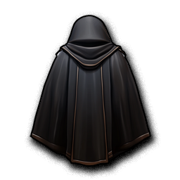 |
| `enchantment_recipe` | Enchantment Recipe | material | 61 | 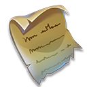 |
| `energy_potion(l)` | Energy Potion(L) | consumable | 3 | .png) |
| `energy_potion(s)` | Energy Potion(S) | consumable | 2 | .png) |
| `gem` | Gem | material | 26 |  |
| `gem_of_life` | Gem of Life | material | 89 |  |
| `gem_of_precision` | Gem of Precision | material | 90 | 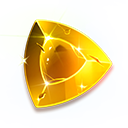 |
| `gem_of_speed` | Gem of Speed | material | 88 |  |
| `gem_of_strengh` | Gem of Strengh | material | 87 |  |
| `gift_for_jenny` | Gift For Jenny | questing | 17 | 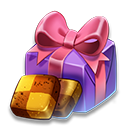 |
| `gold_ore` | Gold Ore | material | 9 | 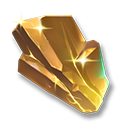 |
| `great_axe` | Great Axe | equipment | 33 | 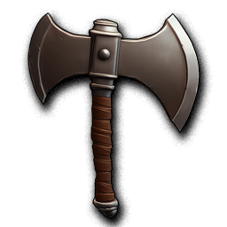 |
| `great_axe_blueprint` | Great Axe Blueprint | material | 29 |  |
| `guard_boots` | Guard's Boots | equipment | 46 | 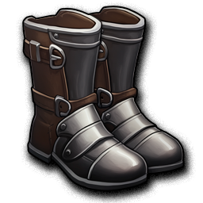 |
| `guard_gauntlet` | Guard's Gauntlet | equipment | 51 | 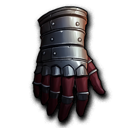 |
| `guard_helmet` | Guard's Helmet | equipment | 54 | 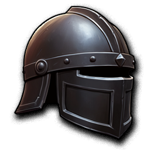 |
| `health_potion(l)` | Health Potion(L) | consumable | 1 | .png) |
| `health_potion(l)_recipe` | Health Potion(L) Recipe | material | 86 | _recipe.png) |
| `health_potion(s)` | Health Potion(S) | consumable | 0 | .png) |
| `herbs` | Herbs | material | 5 |  |
| `iron_ore` | Iron Ore | material | 6 | 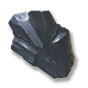 |
| `king_sword` | King's Sword | equipment | 35 | 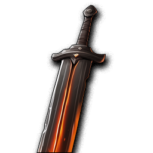 |
| `knight_armor` | Knight's Armor | equipment | 44 | 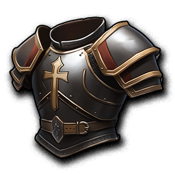 |
| `knight_boots` | Knight's Boots | equipment | 47 | 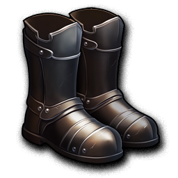 |
| `knight_cape` | Knight's Cape | equipment | 49 | 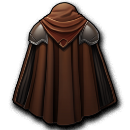 |
| `knight_gauntlet` | Knight's Gauntlet | equipment | 52 | 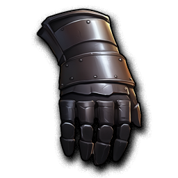 |
| `knight_gauntlet_blueprint` | Knight's Gauntlet Blueprint | material | 27 |  |
| `knight_helmet` | Knight's Helmet | equipment | 55 |  |
| `knight_helmet_blueprint` | Knight's Helmet Blueprint | material | 30 | 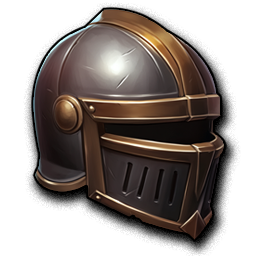 |
| `knight_shield` | Knight's Shield | equipment | 58 | 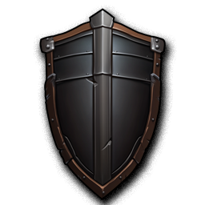 |
| `knight_sword` | Knight's Sword | equipment | 34 | 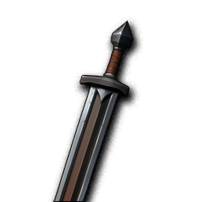 |
| `leather_armor` | Leather Armor | equipment | 42 | 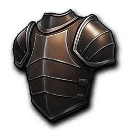 |
| `leather_boots` | Leather Boots | equipment | 45 | 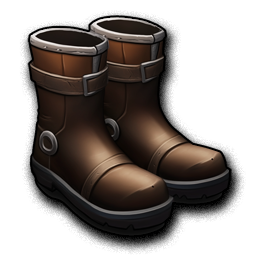 |
| `leather_glove` | Leather Glove | equipment | 50 | 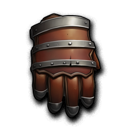 |
| `leather_helmet` | Leather Helmet | equipment | 53 | 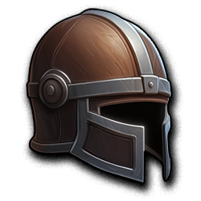 |
| `leather_shield` | Leather Shield | equipment | 57 | 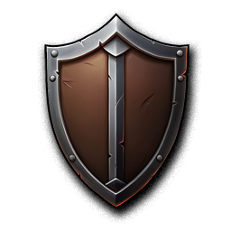 |
| `letter` | Letter | questing | 16 |  |
| `letter_a` | Letter A | quest_item |  | *(no image)* |
| `letter_b` | Letter B | quest_item |  | *(no image)* |
| `letter_c` | Letter C | quest_item |  | *(no image)* |
| `letter_d` | Letter D | quest_item |  | *(no image)* |
| `letter_e` | Letter E | quest_item |  | *(no image)* |
| `letter_f` | Letter F | quest_item |  | *(no image)* |
| `letter_g` | Letter G | quest_item |  | *(no image)* |
| `letter_h` | Letter H | quest_item |  | *(no image)* |
| `letter_i` | Letter I | quest_item |  | *(no image)* |
| `letter_j` | Letter J | quest_item |  | *(no image)* |
| `long_sword` | Long Sword | equipment | 32 | 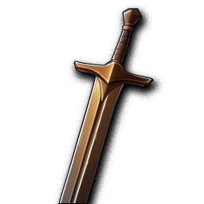 |
| `lucky_fruit` | Lucky Fruit | consumable | 4 | 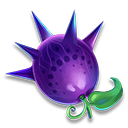 |
| `monster_head` | Monster Head | material | 22 | 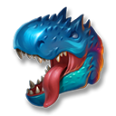 |
| `monster_meat` | Monster Meat | material | 23 | 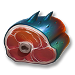 |
| `monster_skin` | Monster Skin | questing | 25 | 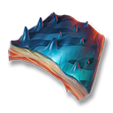 |
| `monster_wing` | Monster Wing | questing | 24 | 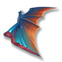 |
| `necklace_of_fire` | Necklace of Fire | equipment | 39 | 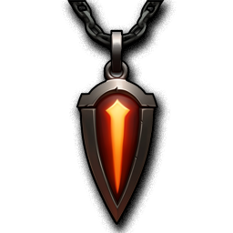 |
| `oak_log` | Oak Log | material | 10 | 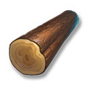 |
| `pass_permit` | Pass Permit | questing | 18 | 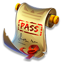 |
| `plate_armor` | Plate Armor | equipment | 43 | 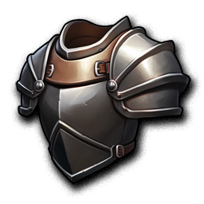 |
| `plate_armor_blueprint` | Plate Armor Blueprint | material | 28 |  |
| `poison` | Poison | questing | 21 |  |
| `power_stone` | Power Stone | material | 59 |  |
| `red_gem_necklace` | Red Gem Necklace | equipment | 41 |  |
| `short_sword` | Short Sword | equipment | 31 |  |
| `shuriken` | Shuriken | equipment | 36 |  |
| `silver_ore` | Silver Ore | material | 8 |  |
| `skill_1` | Skill 1 | skill | 62 |  |
| `skill_10` | Skill 10 | skill | 71 |  |
| `skill_11` | Skill 11 | skill | 72 |  |
| `skill_12` | Skill 12 | skill | 73 |  |
| `skill_13` | Skill 13 | skill | 74 |  |
| `skill_14` | Skill 14 | skill | 75 |  |
| `skill_15` | Skill 15 | skill | 76 |  |
| `skill_16` | Skill 16 | skill | 77 |  |
| `skill_17` | Skill 17 | skill | 78 |  |
| `skill_18` | Skill 18 | skill | 79 |  |
| `skill_19` | Skill 19 | skill | 80 |  |
| `skill_2` | Skill 2 | skill | 63 |  |
| `skill_20` | Skill 20 | skill | 81 |  |
| `skill_21` | Skill 21 | skill | 82 |  |
| `skill_22` | Skill 22 | skill | 83 |  |
| `skill_23` | Skill 23 | skill | 84 |  |
| `skill_24` | Skill 24 | skill | 85 |  |
| `skill_3` | Skill 3 | skill | 64 |  |
| `skill_4` | Skill 4 | skill | 65 |  |
| `skill_5` | Skill 5 | skill | 66 |  |
| `skill_6` | Skill 6 | skill | 67 |  |
| `skill_7` | Skill 7 | skill | 68 |  |
| `skill_8` | Skill 8 | skill | 69 |  |
| `skill_9` | Skill 9 | skill | 70 |  |
| `slash_ability` | Slash Ability | ability_unlock |  | *(no image)* |
| `strange_egg` | Strange Egg | questing | 19 |  |
| `walnut_log` | Walnut Log | material | 11 |  |
| `wolf_claw` | Wolf's Claw | material | 14 |  |
| `wolf_skin` | Wolf's Skin | material | 12 |  |
| `word_hero_badge` | Word Hero Badge | accessory |  | *(no image)* |
