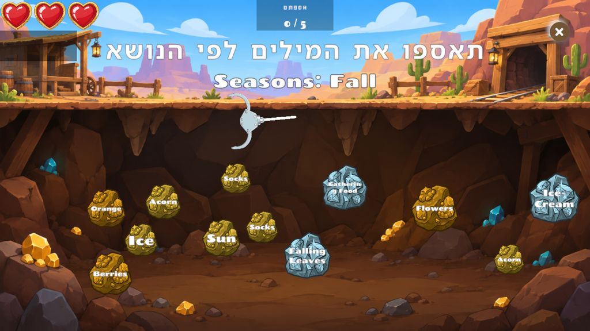

# Minigame: Dwarf Miner

**ID:** `dwarf_miner`  
**Category:** Vocabulary  
**Difficulty range:** 1–8  
**Registry:** `_registry/minigames.yaml`  
**Unity:** `DwarfMinerQuestConfigSO` → `MinerCategoryDataSO`



---

## What it is

A dwarf stands at the top of a mine and swings a hook. Word orbs lie in the cave below. The player
fires the hook to pull up the words that **belong to the category** (e.g. winter clothes) and avoids
the ones that don't. Collecting `requiredCorrect` good words wins; collecting `allowedMistakes` wrong
words costs every heart and restarts the round.

---

## Screen layout

```
┌──────────────────────────────────────────────┐
│ ♥ ♥ ♥                          0 / 5      ×  │
│      [Winter]  תאספו את המילים לפי הנושא      │  ← prompt + category banner
│                    ⛏ dwarf                   │
│                     \  hook swings           │
│   (Snow)    (Sun)     (Boots)    (Beach)     │  ← word orbs
│        (Jacket)   (Flowers)   (Ice)          │
└──────────────────────────────────────────────┘
```

---

## Parameters (`params`)

| Field | Meaning |
|-------|---------|
| `prompt` | Hebrew instruction above the cave |
| `categoryLabel` | Short subject shown on the banner (`Winter`, `Verbs`, `Adjectives`) |
| `targetWords` | Words that belong — each one collected scores |
| `distractorWords` | Words that don't belong — each one collected costs a heart |
| `requiredCorrect` | X — correct words that end the round (capped at the words placed) |
| `allowedMistakes` | Y — wrong words that restart the round (number of hearts) |
| `background` | Optional cave backdrop sprite path; empty keeps the default mine |

Hearts use the game's default sprites; the Unity importer fills them in.

---

## When to use

**Use when:**
- The lesson groups words by meaning: seasons, clothes, animals, verbs vs. nouns, opposites
- You want a quick recognition check before spelling or speaking the words
- Level 1+ — the child only needs to recognise the word, not write it

**Don't use when:**
- The goal is spelling — use `letter_ordering` or `fruit_slice`
- The goal is sentence order — use `word_ordering` or `fruit_slice` (Words)

**Tips:** keep 5–7 target words and 4–6 distractors that are clearly outside the category.
