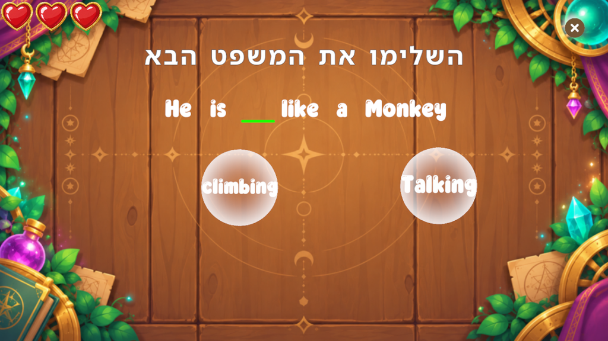

# Minigame: Fruit Slice

**ID:** `fruit_slice`  
**Category:** Spelling / sentence order  
**Difficulty range:** 1–8  
**Registry:** `_registry/minigames.yaml`  
**Unity:** `FruitSliceQuestConfigSO` → `SliceOrderingDataSO`



---

## What it is

Fruits carrying letters (or words) are thrown up across the board. The player swipes to slice them
**in the right order** to fill the answer bar. Slicing a wrong fruit costs a heart.

`segmentation` decides how the answer is cut:

- **Letters** — `targetText` is one word (`apple`) and each fruit is one letter.
- **Words** — `targetText` is a sentence (`He is climbing like a monkey`) and each fruit is one word.

---

## Screen layout

```
┌──────────────────────────────────────────────┐
│ ♥ ♥ ♥                                     ×  │
│            איך רושמים פרה                     │  ← prompt
│        [ C ] [   ] [   ]                      │  ← answer bar (pre-filled slots locked)
│     🍎 O        🍊 W       🍎 T    🍋 B        │  ← flying fruit
└──────────────────────────────────────────────┘
```

---

## Parameters (`params`)

| Field | Meaning |
|-------|---------|
| `prompt` | Hebrew instruction / sentence above the answer bar |
| `segmentation` | `Letters` or `Words` |
| `targetText` | The answer: one word (Letters) or a sentence (Words) |
| `preFilledIndices` | Zero-based segments shown from the start and locked |
| `distractors` | Wrong segments thrown as fruit |
| `extraLetterDistractorCount` | Letters mode only: random wrong letters when `distractors` is empty |
| `background` | Optional board sprite path; empty keeps the default board |

Hearts use the game's default sprites; the Unity importer fills them in.

---

## When to use

**Use when:**
- Spelling a new word with a bit more energy than `letter_ordering`
- Practising word order in a short sentence (Words mode, lock the easy words with `preFilledIndices`)

**Don't use when:**
- The child can't read the letters yet — start with `letter_drawing`
- The sentence is long (more than ~6 words) — fruit gets crowded; use `word_ordering`
