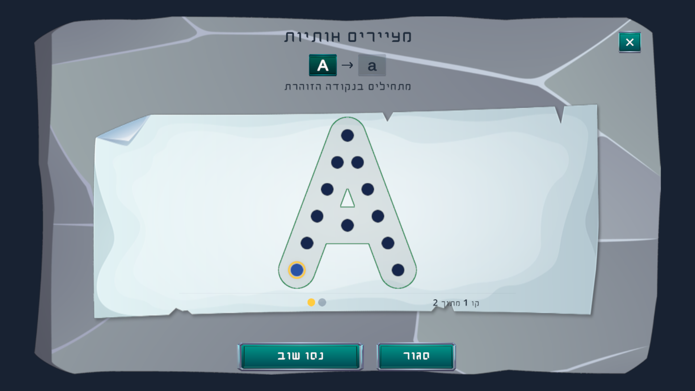

# Minigame: Letter Drawing

**ID:** `letter_drawing`  
**Unity config:** `LetterTracingQuestConfigSO`  
**Unity content:** `TracingLessonSO` referencing ready `SymbolPathSO` assets  
**Learning focus:** English letter formation and stroke order



The screenshot shows the real Unity prefab in an isolated Editor preview, with the museum's A → a sequence. Open World quests can select any sequence.

## Current gameplay

1. The child starts at the highlighted point and follows the points in each authored stroke.
2. Passed points disappear quickly. The gold ring marks the current point.
3. The stroke counter shows progress through the current letter.
4. Once all strokes are complete, the points disappear before the final letter animation.
5. The next selected letter opens automatically. Completing the entire list completes the minigame objective once.
6. **Try again** restarts the current letter. **Close** cancels without granting quest completion.

Each letter has its own fill color. Its uppercase and lowercase forms share that color; point colors are authored separately for contrast. Strokes, points, sprites, colors and letter audio come from Unity's ready assets.

## Open World authoring

In QuestForge choose **Letter Drawing**, then select **Letters in order**. Each list row chooses one of the 52 ready letters, A–Z or a–z. The selected case, order and repetitions are preserved.

```yaml
minigame_id: letter_drawing
variant: trace_guided
instruction: "ציירו את האותיות לפי הסדר"
target: "A, b, C"
params:
  symbols: ["A", "b", "C"]
```

A single letter is valid, for example `symbols: ["b"]`. There is no automatic A → a pairing in Open World. The museum drawing table continues to require uppercase followed by lowercase.

## Quest step

Attach the instance to a real catalog station:

```yaml
- type: play_minigame
  minigame_id: letter_drawing
  instance_id: my_line__q01_drawing
  world_object_id: Exam_Table1_Outside_Gate
  difficulty: 1
```

The instance key must refer to an authored instance. `difficulty` is quest metadata; it does not switch tracing into a different recognition mode. Start with one letter, then introduce short lists of familiar letters.

## Quest Sync into Unity

Database Sync creates the usual `QuestLineSO`, `QuestDefinitionSO` and station-bound objective. For each Letter Drawing instance it creates:

- `TracingLesson_<instance>.asset`, with references to the exact uppercase/lowercase `SymbolPathSO` assets;
- `LetterTracingQuestConfig_<instance>.asset`, with the station game ID and lesson reference.

Repeated imports update the same generated assets. Existing published exercises with `params.letter` or a single-letter `target` still import as one letter, preserving case. Empty lists, invalid IDs or missing ready tracing assets stop import before quest assets are written.

## Supported mode

`trace_guided` is the supported mechanic. Completion requires every authored point in order. The current game does not use coverage thresholds, ML handwriting recognition, free drawing, or a manual Done button. Do not author new strokes or Unity asset paths on the website.

## Learning checklist

- Introduce the letter and its case in the quest dialogue.
- Choose a real station from the catalog.
- Select ready letters in the intended order.
- Keep beginner exercises short.
- Award quest rewards through the existing quest system after the whole exercise.

## See also

- [Letter Ordering](letter_ordering.md)
- [When to use this minigame](../when-to-use-minigames.md)
