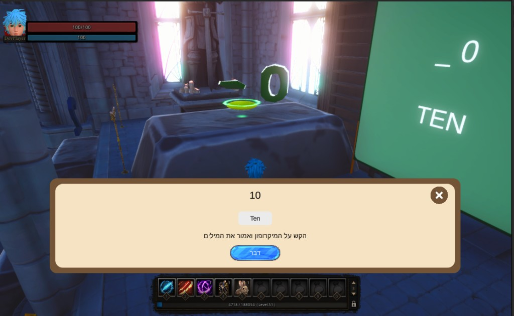

# Minigame: Speak Aloud

**ID:** `speak_aloud`  
**Category:** Pronunciation  
**Difficulty range:** 4–10  
**Registry:** `_registry/minigames.yaml`  
**Requires:** Microphone permission



---

## What it is

The UI shows a word or short phrase the player must **say out loud in English**. The player taps the microphone button, speaks, and speech recognition checks if they said it correctly. On match, the minigame completes.

This is the most **advanced** minigame — introduce after children are comfortable with reading and hearing words.

---

## Screen layout

```
┌─────────────────────────────────────────┐
│  המשימה: אמרו את המילה הבאה באנגלית בקול │  ← required Hebrew explanation
│                                         │
│         🐶  dog                         │  ← big English target + picture
│                                         │
│     [ 🔊 Hear it ]                      │  ← plays native audio
│                                         │
│     [ 🎤 Press and speak ]              │
│                                         │
│     ○ ○ ○ ○ ○  listening...            │
└─────────────────────────────────────────┘
```

On success: "מצוין! I heard **dog**!"

---

## Variants

### 1. Single word (difficulty 4–6)

| Prompt (HE) | Target (EN) | Example |
|-------------|-------------|---------|
| אמור: כלב | dog | CVC words |
| אמור: חתול | cat | Early vocabulary |
| אמור: דג | fish | — |

### 2. Short phrase (difficulty 7–8)

| Target |
|--------|
| good morning |
| thank you |
| my name is… |

### 3. Repeat after NPC (difficulty 6–9)

1. NPC voice plays the word/phrase
2. Player repeats into microphone
3. Side-by-side: NPC waveform → your turn

**Best for:** Confidence building — child hears correct model first.

## Content difficulty levels

The Speak Aloud format is selected by the approved questline brief, not automatically by the minigame:

| Level | Target | Rule |
|-------|--------|------|
| 1 | One word | Default format and first pronunciation stage |
| 2 | Several words or one short sentence | Choose according to the lesson topic; keep the sentence short |
| 3 | More words or a harder sentence | Use only when the questline difficulty and approved plan justify it |

Several words or a sentence must be added only when the user requests that format or approves it in the pedagogical plan. Calling a questline difficult allows proposing Level 2 or Level 3, but does not justify a long or overloaded sentence.

---

## Difficulty scaling

| Difficulty | Content | Tolerance |
|------------|---------|-----------|
| 4 | 3-letter CVC (dog, cat, sun) | High — accepts close pronunciation |
| 5 | 4-letter words (fish, book) | High |
| 6 | Words with blends (ship, frog) | Medium |
| 7 | Short phrases (2 words) | Medium |
| 8 | Phrases with th/sh (thank you) | Medium-low |
| 9–10 | Longer sentences, name intro | Lower tolerance |

For children, **always bias toward lenient recognition** — false negatives hurt confidence more than false positives.

---

## World triggers

| Interactable | Story hook |
|--------------|------------|
| NPC | Teacher listens to your pronunciation |
| Echo crystal | "Speak to open the cave" |
| Magic mirror | "Say the magic word" |
| Training dummy | Guard Marcus wants you to shout commands |
| Locked door | Voice-activated lock (say "open") |

---

## Microphone UX flow

1. First time: OS permission prompt with kid-friendly explanation (Hebrew).
2. Tap mic → visual "listening" state (pulsing ring).
3. Auto-stop after 2–3 seconds of silence OR manual stop tap.
4. Processing spinner (short).
5. Result: success animation OR gentle retry with "Hear it again" button.

### Privacy

- No recording storage required for MVP — process locally or discard after check
- Parental settings gate for mic access if needed

---

## Prompt content contract

The prompt must explain both the action and the meaning. For one word, use a Hebrew instruction such as `אמרו באנגלית בקול את המילה שפירושה כף` (“Say aloud in English the word meaning spoon”). For several words or a sentence, include the complete natural Hebrew translation of the exact target. A generic instruction such as “say the next word aloud” is incomplete because it does not explain the word's meaning.

## Runtime display contract

The real game screen must show the Hebrew explanatory prompt and the English target together. The target alone is not enough: a screen that displays only `book`, `dog`, or another English word without explaining that the learner must say it aloud is invalid. The Editor Preview and the game must use the same authored prompt; the game must not silently omit it.

## Success / failure rules

| Rule | Detail |
|------|--------|
| Success | STT result matches target (fuzzy match) |
| Failure | "לא שמעתי בבירור. נסה שוב!" — never "Wrong!" |
| Retry | Unlimited |
| Hint | "Hear it" button always available |
| Skip | **Not** for required steps — but optional practice nodes can skip |

---

## Example quest YAML

```yaml
- type: talk_to_npc
  npc_id: teacher_maya
  dialogue_id: maya_say_dog

- type: play_minigame
  minigame_id: speak_aloud
  difficulty: 4
  # target_word: "dog"
  # prompt_he: "אמור: כלב"
  # show_image: true

- type: return_to_npc
  npc_id: teacher_maya
  dialogue_id: maya_proud_pronunciation
```

---

## English-learning checklist

- [ ] Child has seen and heard the word before this step (talk + prior minigame)
- [ ] "Hear it" button plays slow, clear native audio
- [ ] Picture supports meaning for the word
- [ ] Not used as the **first** exposure to a new word
- [ ] Quest line difficulty ≥ 4 before introducing speak_aloud
- [ ] Quiet environment hint in UI ("Find a quiet place")

## When NOT to use yet

| Situation | Use instead |
|-----------|-------------|
| Brand-new vocabulary | `word_matching` or `letter_ordering` |
| First quest in game | `letter_drawing` |
| Child under 6 without reading base | Listen-only NPC dialogue first |
| No mic / school lab PCs | Optional step or `success_required: false` fallback |

## See also

- [When to use this minigame](../when-to-use-minigames.md)
- [Word Matching](word_matching.md) — prerequisite vocabulary practice
