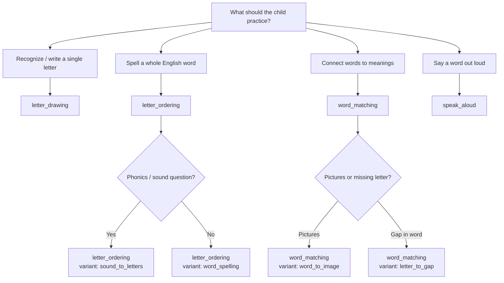

# When to Use Each Minigame

Choose the minigame that matches **what skill** the child should practice in this quest step — not what object happens to be in the scene. The interactable (chest, gate, board) is just the door in; the minigame is the lesson.

**Registry:** `_registry/minigames.yaml`

---

## Decision flowchart



---

## Comparison table

| Minigame | Skill | Typical age/level | Hebrew prompt style | Example |
|----------|-------|-------------------|---------------------|---------|
| [letter_drawing](minigames/letter_drawing.md) | Write a letter | 1–4 | צייר את האות A | Trace uppercase A |
| [letter_ordering](minigames/letter_ordering.md) | Spell a word | 1–6 | תרשום כלב | d + o + g |
| [word_matching](minigames/word_matching.md) | Vocab / gaps | 2–8 | התאם מילה לתמונה | dog ↔ 🐶 |
| [speak_aloud](minigames/speak_aloud.md) | Pronunciation | 4–10 | אמור: כלב | Say "dog" |

---

## When to use `letter_drawing`

**Use when:**
- First time introducing a **new letter** (A, B, C…)
- Child is level 1–4
- Quest theme is classroom, chalkboard, sand table
- You need a **gentle** step before spelling full words

**Don't use when:**
- Child already traced this letter 3+ times — upgrade to `letter_ordering`
- Goal is full word spelling — use `letter_ordering`
- Goal is pronunciation — use `speak_aloud`

**Pair with:** `collect_item` (`letter_a`) right after success.

---

## When to use `letter_ordering`

**Use when:**
- Child knows the letters and must **spell a word**
- Prompt is Hebrew word → English spelling (תרשום כלב → dog)
- Gate/chest password is a word
- Phonics lesson: שש → **sh**, צ' → **ch**

**Don't use when:**
- Child hasn't seen the word yet — add `talk_to_npc` first
- Word has 7+ letters at low level — shorten or split quest
- Goal is only picture recognition — use `word_matching`

**Variants:**

| Situation | Variant |
|-----------|---------|
| "Write the Hebrew word in English letters" | `word_spelling` |
| "What letters make this sound?" | `sound_to_letters` |
| Password from quest story | `word_spelling` + story prompt |

**Pair with:** `talk_to_npc` intro, `return_to_npc` recap.

---

## When to use `word_matching`

**Use when:**
- Teaching **3 vocabulary words** at once (animals, colors, food)
- Child must link **word ↔ image**
- Child knows letters but needs **missing-letter** practice (o → d_g)
- Market, library, or sorting theme

**Don't use when:**
- Only one word in the lesson — `letter_ordering` is tighter
- Child can't read any letters yet — use `letter_drawing` + image-only matching with 2 pairs max
- First quest ever — start with drawing or 2-pair matching only

**Variants:**

| Situation | Variant |
|-----------|---------|
| 3 words + 3 pictures | `word_to_image` |
| Missing middle letter | `letter_to_gap` |
| Hebrew ↔ English (advanced) | `word_to_translation` |

**Pair with:** `reach_location` (go to market), `talk_to_npc` (introduce all 3 words).

---

## When to use `speak_aloud`

**Use when:**
- Child has **already** seen, read, and matched the word
- Level 4+ and confidence is building
- NPC "listens" to pronunciation
- Quest climax: prove you can say the magic word

**Don't use when:**
- Word is brand new this quest
- Level 1–3 curriculum track
- No microphone (offer alternate path or different minigame)
- Classroom with 30 kids and one mic — use optional bonus step only

**Pair with:** `word_matching` warm-up in same quest, `talk_to_npc` with NPC model audio.

---

## Curriculum order (recommended)

Introduce minigames to players in this order across the quest line:

```
1. letter_drawing     (letter A)
2. letter_ordering    (3-letter word: cat)
3. word_matching      (2 pairs: cat, dog)
4. letter_ordering    (phonics: sh)
5. word_matching      (letter_to_gap)
6. speak_aloud        (single word)
7. All four in rotation with harder content
```

---

## One quest, which minigame?

| Lesson goal | Pick |
|-------------|------|
| "Today: letter B" | `letter_drawing` |
| "Today: spell dog" | `letter_ordering` |
| "Today: 3 animals" | `word_matching` (images) |
| "Today: missing vowels" | `word_matching` (gaps) |
| "Today: say hello" | `speak_aloud` |
| "Today: שש sounds like…" | `letter_ordering` (sound_to_letters) |

---

## Difficulty vs minigame

| Difficulty | Best minigames |
|------------|----------------|
| 1–2 | `letter_drawing`, easy `letter_ordering` (3 letters) |
| 3–4 | `letter_ordering`, `word_matching` (2–3 pairs) |
| 5–6 | `word_matching` gaps, longer ordering |
| 7–8 | Mixed rounds, `speak_aloud` single words |
| 9–10 | `speak_aloud` phrases, hard matching |

---

## World flavor (same minigame, different skin)

The minigame logic stays the same; only the interactable art changes:

| Minigame | Chest | Gate | NPC | Board |
|----------|-------|------|-----|-------|
| letter_ordering | ✓ | ✓ | slate | sign |
| word_matching | ✓ | — | stall | bulletin |
| letter_drawing | — | — | chalkboard | sand table |
| speak_aloud | — | echo door | teacher | mirror |

On success: chest opens, gate opens, or nothing — all valid. The **learning moment** is the minigame UI, not the animation after.

---

## See also

- [When to use each step](when-to-use.md)
- [Play minigame step](steps/play_minigame.md)
