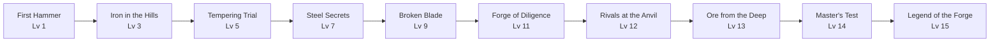

# Quest Lines — Design Overview

> **Interactive map:** Open [`viewer.html`](viewer.html) in your browser — click quest lines, then quests, to explore steps and rewards.

**5 quest lines · 50 quests · Levels 1–30**

Use this document for boss presentations. Each questline has a visual graph in its folder (`_graph.mmd`).

---

## At a glance

| # | Quest line | NPC | Quests | Levels | Theme |
|---|------------|-----|--------|--------|-------|
| 1 | [Theron's Forge Path](../questlines/blacksmith_theron/_index.yaml) | Theron (Blacksmith) | 10 | 1–15 | Crafting |
| 2 | [Lina's Trade Route](../questlines/merchant_lina/_index.yaml) | Lina (Merchant) | 10 | 5–20 | Commerce |
| 3 | [Captain Marcus's Command](../questlines/guard_captain_marcus/_index.yaml) | Captain Marcus | 10 | 10–25 | Combat |
| 4 | [Elara's Garden Path](../questlines/herbalist_elara/_index.yaml) | Elara (Herbalist) | 10 | 3–18 | Gathering |
| 5 | [Vex's Hidden Truth](../questlines/mystery_stranger_vex/_index.yaml) | Vex (Stranger) | 10 | 15–30 | Mystery |

---

## 1. Theron's Forge Path

**NPC:** Theron · **Location:** Forge District · **Status:** 3 quests fully designed, 7 drafts



| Quest | Level | XP | Key reward |
|-------|-------|-----|------------|
| First Hammer | 1 | 50 | Rusty Hammer |
| Iron in the Hills | 3 | 120 | Iron Ore ×5 |
| Tempering Trial | 5 | 200 | Iron Ore ×3 |
| Steel Secrets | 7 | 280 | Steel Ingot ×2 |
| The Broken Blade | 9 | 350 | — |
| Forge of Diligence | 11 | 420 | Steel Ingot ×3 |
| Rivals at the Anvil | 12 | 480 | — |
| Ore from the Deep | 13 | 520 | Iron Ore ×10 |
| Master's Test | 14 | 600 | Steel Ingot ×5 |
| Legend of the Forge | 15 | 800 | Master Forge Blueprint |

**Example quest flow (First Hammer):** Talk to Theron → Basic forging minigame → Return to Theron

---

## 2. Lina's Trade Route

**NPC:** Lina · **Location:** Market Square · **Status:** 1 quest fully designed, 9 drafts

| Quest | Level | XP | Key reward |
|-------|-------|-----|------------|
| First Sale | 5 | 100 | Merchant's Satchel |
| Spice Run | 7 | 180 | Rare Spice ×3 |
| Debt Collection | 9 | 250 | Trade Token ×5 |
| Market Rivals | 11 | 320 | — |
| Rare Import | 13 | 400 | Rare Spice ×5 |
| The Lost Shipment | 15 | 480 | Gold Pouch |
| Counterfeit Coins | 16 | 520 | Trade Token ×10 |
| Trade Route | 17 | 560 | — |
| Merchant's Gamble | 18 | 620 | Gold Pouch ×2 |
| Empire of Trade | 20 | 900 | Satchel + Gold Pouch ×3 |

---

## 3. Captain Marcus's Command

**NPC:** Captain Marcus · **Location:** City Barracks · **Status:** 1 quest fully designed, 9 drafts

| Quest | Level | XP | Key reward |
|-------|-------|-----|------------|
| Enlistment | 10 | 200 | Guard Badge |
| Night Patrol | 12 | 300 | Patrol Map |
| Bandit Camp | 14 | 380 | — |
| Missing Scout | 16 | 450 | Patrol Map |
| Wall Breach | 18 | 520 | Reinforced Shield |
| Arena Trial | 19 | 560 | — |
| The Saboteur | 21 | 640 | — |
| Siege Prep | 22 | 700 | Reinforced Shield |
| Last Stand | 24 | 780 | — |
| Captain's Legacy | 25 | 1000 | Captain's Commendation |

---

## 4. Elara's Garden Path

**NPC:** Elara · **Location:** Mistwood Outskirts · **Status:** 1 quest fully designed, 9 drafts

| Quest | Level | XP | Key reward |
|-------|-------|-----|------------|
| Healing Hands | 3 | 80 | Healing Herb ×5 |
| Forest Herbs | 5 | 150 | Healing Herb ×10 |
| Poison Remedy | 7 | 220 | Alchemy Vial |
| Moonpetal Hunt | 9 | 300 | Moonpetal ×3 |
| Swamp Samples | 11 | 380 | — |
| Alchemist's Aid | 12 | 420 | Alchemy Vial ×2 |
| Rare Bloom | 14 | 500 | Moonpetal ×5 |
| Plague Cure | 15 | 550 | — |
| Spirit Tea | 16 | 600 | Healing Herb ×15 |
| Elara's Secret | 18 | 750 | Elixir Recipe |

---

## 5. Vex's Hidden Truth

**NPC:** Vex · **Location:** Appears dynamically · **Status:** 1 quest fully designed, 9 drafts

| Quest | Level | XP | Key reward |
|-------|-------|-----|------------|
| A Whisper in the Dark | 15 | 400 | Cryptic Note |
| The Hidden Door | 17 | 480 | Shadow Key |
| Shadows Follow | 19 | 560 | — |
| Cryptic Map | 21 | 640 | Cryptic Note |
| The Locked Chest | 23 | 720 | — |
| Names Unspoken | 24 | 760 | Vex Sigil |
| Mirror Trial | 26 | 840 | — |
| Sigil of Vex | 27 | 880 | Vex Sigil |
| The Other Side | 28 | 920 | Shadow Key |
| Truth Revealed | 30 | 1200 | Ancient Relic |

---

## How a quest node expands

Each row above is a **quest node**. Open its YAML file to see the internal steps:

```
Quest Node                    Quest Steps (inside)
─────────────────────────────────────────────────────
First Hammer (Lv 1)     →     1. Talk to Theron
                              2. Basic forging minigame
                              3. Return to Theron
```

Step types are defined once in [`_registry/systems.yaml`](../_registry/systems.yaml): `talk_to_npc`, `play_minigame`, `collect_item`, `deliver_item`, `reach_location`, `defeat_enemy`, etc.

---

## Navigation guide

| I want to… | Open |
|------------|------|
| See all quests in a line | `questlines/<npc>/_index.yaml` |
| See quest flow visually | `questlines/<npc>/_graph.mmd` |
| Edit one quest's steps | `questlines/<npc>/qXX_name.yaml` |
| Add a new step type | `_registry/systems.yaml` |
| Add NPC or item | `_registry/npcs.yaml` or `items.yaml` |

---

## Progress tracker

| Questline | Index | Graph | Quest files | Fully designed |
|-----------|-------|-------|-------------|----------------|
| Blacksmith | ✅ | ✅ | 10/10 | 3/10 |
| Merchant | ✅ | ✅ | 10/10 | 1/10 |
| Guard | ✅ | ✅ | 10/10 | 1/10 |
| Herbalist | ✅ | ✅ | 10/10 | 1/10 |
| Mystery | ✅ | ✅ | 10/10 | 1/10 |

**Next step:** Flesh out draft quests using AI — one quest at a time, without loading the full 50.
