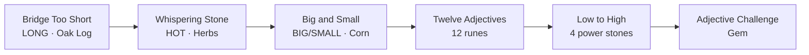
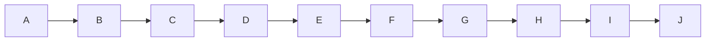
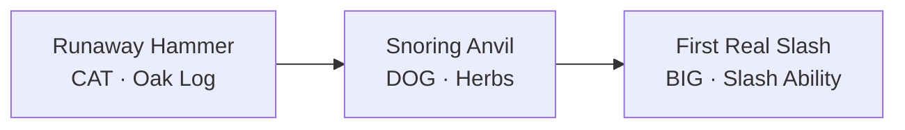

# Quest Lines — Design Overview

> **Interactive map:** Open [`viewer.html`](viewer.html) in your browser — click quest lines, then quests, to explore steps and rewards.

**4 quest lines · 26 quests · Synced to Unity OpenWorld catalogs**

Use this document for boss presentations. Each questline has a visual graph in its folder (`_graph.mmd`).

Source of truth: Unity `QuestWorldCatalogSet_OpenWorld` — see [`_registry/unity_mapping.yaml`](../_registry/unity_mapping.yaml).

---

## At a glance

| # | Quest line | NPC | Quests | Status | Theme |
|---|------------|-----|--------|--------|-------|
| 1 | [The Adjective Crown](../questlines/adjective_crown/_index.yaml) | Teacher Maya | 6 | **Live in Unity** | Basic adjectives via minigames + SoftKitty deliveries |
| 2 | [English Kingdom — Letter Path](../questlines/english_kingdom_maya/_index.yaml) | Teacher Maya | 10 | Authored here | Letters A–J on Open World stations |
| 3 | [Will the Smith — First Slash](../questlines/blacksmith_will/_index.yaml) | Blacksmith Will | 3 | Authored here | Silly forge fun; unlock Slash (CAT / DOG / BIG) |
| 4 | [The Kingdom Book of Nouns](../questlines/kingdom_nouns/_index.yaml) | Teacher Maya | 7 | Authored here | שמות עצם — spell + speak (q01 Lv50; rest Lv1) |

---

## 1. The Adjective Crown (live)

**NPC:** Teacher Maya · **Pattern:** EnterArea → CompleteMiniGame → DeliverItem · **SoftKitty items:** oak_log, herbs, corn, ancient_rune, power_stone, gem

```mermaid
flowchart LR
  Q1["Bridge Too Short<br/>LONG · Oak Log"] --> Q2["Whispering Stone<br/>HOT · Herbs"]
  Q2 --> Q3["Big and Small<br/>BIG/SMALL · Corn"]
  Q3 --> Q4["Twelve Adjectives<br/>12 runes"]
  Q4 --> Q5["Low to High<br/>4 power stones"]
  Q5 --> Q6["Adjective Challenge<br/>Gem"]
```

| Quest | Area | Station | Minigames |
|-------|------|---------|-----------|
| q01 | The Oathstone Bridge | WoodenCart3_The_Oath_stone_Bridge | letter_ordering |
| q02 | TowerOfLostVigil | Fire_Camp_Tower_Of_Lost_Vigil | speak_aloud |
| q03 | The Sunspire Tree | Lost_Chest7_The_Sunspire_Tree | letter_ordering, speak_aloud |
| q04 | The Weeping Stones | Tomb_Stone_The_Weeping_Stones | letter_ordering, speak_aloud ×12 |
| q05 | The Last Roar | Lost_Chest6_The_Last_Roar | letter_ordering, word_ordering |
| q06 | Sanctum of Whispering Light | Lost_Chest4_Sanctum_Of_Whispering_Light | word_matching ×3 |

---

## 2. English Kingdom — Letter Path

**NPC:** Teacher Maya · **Levels:** 1–10 · **Status:** Authored with OpenWorld IDs (QuestDefinition SOs not in Unity yet)

```mermaid
flowchart LR
  Q1["A"] --> Q2["B"] --> Q3["C"] --> Q4["D"] --> Q5["E"]
  Q5 --> Q6["F"] --> Q7["G"] --> Q8["H"] --> Q9["I"] --> Q10["J"]
```

| Quest | Letter | Area | Station |
|-------|--------|------|---------|
| q01 | A | MoonriverCottage | Small_Shop_Moonriver |
| q02 | B | BuildersHome | Lost_Chest1_BuildersHomeArea |
| q03 | C | Driftgold Bay | Lost_Chest2_Driftgold_Bay |
| q04 | D | FairyRosePark | Exam_Table_Fairy_Rose_Park |
| q05 | E | Forsaken Cove | Lost_Chest3_Forsaken_Cove |
| q06 | F | KingdomGate | Wooden_Cart1_Inside_Gate |
| q07 | G | KingdomGate | Exam_Table1_Outside_Gate |
| q08 | H | Sanctum of Whispering Light | Lost_Chest4_Sanctum_Of_Whispering_Light |
| q09 | I | SilverFountainCourt | Lost_Chest5_Silver_Fountain_Court |
| q10 | J | Solitude Tower | WoodenCart2_Solitude_Tower |

---

## 3. Will the Smith — First Slash

**NPC:** Blacksmith Will · **Levels:** 1 · **Status:** Authored here · **Pattern:** letter_ordering only (CAT / DOG / BIG) · **Unlock:** `slash_ability` on q03

```mermaid
flowchart LR
  Q1["Runaway Hammer<br/>CAT · Oak Log"] --> Q2["Snoring Anvil<br/>DOG · Herbs"]
  Q2 --> Q3["First Real Slash<br/>BIG · Slash Ability"]
```

| Quest | Word | Area | Station | Reward |
|-------|------|------|---------|--------|
| q01 | CAT | Driftgold Bay | Lost_Chest2_Driftgold_Bay | Oak Log delivery |
| q02 | DOG | BuildersHome | Lost_Chest1_BuildersHomeArea | Herbs delivery |
| q03 | BIG | KingdomGate | Wooden_Cart1_Inside_Gate | **slash_ability** |

---

## 4. The Kingdom Book of Nouns

**NPC:** Teacher Maya (hub) · **Levels:** q01 = 50, q02–q07 = 1 · **Status:** Authored here · **Pattern:** EnterArea → letter_ordering → speak_aloud → DeliverItem · **SoftKitty:** gem, power_stone, ancient_rune

Supporting givers: City Gaurd Info, Professor Crazy, Blacksmith, Old Woman, Cannoneer. No `word_matching`.

```mermaid
flowchart LR
  Q1["Roles<br/>Lv50 · KING"] --> Q2["Places<br/>Lv1 · CASTLE"]
  Q2 --> Q3["Treasury<br/>Lv1 · CROWN"]
  Q3 --> Q4["Armory<br/>Lv1 · SHIELD"]
  Q4 --> Q5["Court<br/>Lv1 · WIZARD"]
  Q5 --> Q6["Creatures<br/>Lv1 · DRAGON"]
  Q6 --> Q7["Trial<br/>Lv1 · REVIEW"]
```

| Quest | Nouns | Area | Station | Deliverable |
|-------|-------|------|---------|-------------|
| q01 | king, queen, knight | SilverFountainCourt | Lost_Chest5_Silver_Fountain_Court | Gem → Teacher Maya |
| q02 | castle, tower, gate | KingdomGate | Exam_Table1_Outside_Gate | Gem → City Gaurd Info |
| q03 | crown, throne, treasure | Solitude Tower | WoodenCart2_Solitude_Tower | Power Stone → Professor Crazy |
| q04 | sword, shield, scroll | The Oathstone Bridge | WoodenCart3_The_Oath_stone_Bridge | Power Stone → Blacksmith |
| q05 | wizard, cook, guard | TowerOfLostVigil | Fire_Camp_Tower_Of_Lost_Vigil | Power Stone → Old Woman |
| q06 | dragon, griffin, goblin | Forsaken Cove | Lost_Chest3_Forsaken_Cove | Ancient Rune → Cannoneer |
| q07 | mixed review | Sanctum of Whispering Light | Lost_Chest4_Sanctum_Of_Whispering_Light | Ancient Rune → Teacher Maya |

---

## Allowed step types (Unity)

| YAML | Unity QuestObjectiveType |
|------|--------------------------|
| `talk_to_npc` / `return_to_npc` | TalkToNpc |
| `reach_location` | EnterArea |
| `play_minigame` | CompleteMiniGame |
| `collect_item` | Collect |
| `deliver_item` | DeliverItem |

## Allowed minigames

`letter_ordering` · `word_ordering` · `word_matching` · `letter_drawing` · `speak_aloud`
